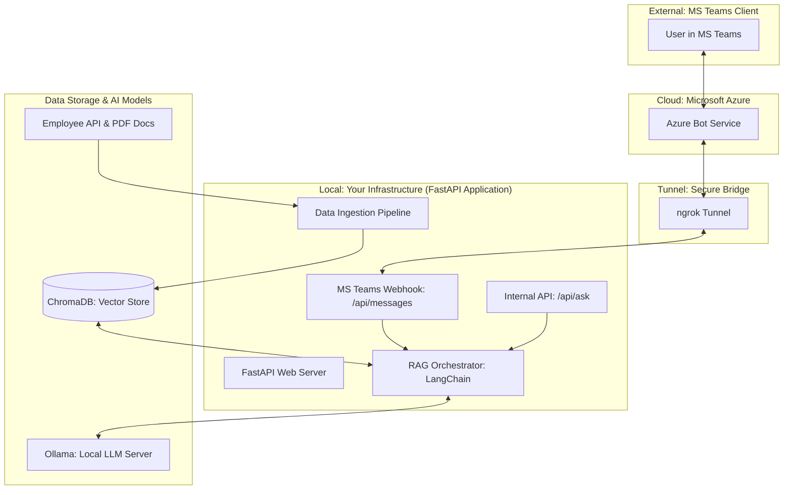

# ResoAI High-Level Architecture

This document describes the high-level architecture of the ResoAI HR Chatbot system. It follows a **Local-First RAG** (Retrieval-Augmented Generation) pattern, ensuring data privacy by keeping employee records and AI computation on-premises.

## System Workflow Diagram

## Component Breakdown

### 1. External & Cloud
- **MS Teams**: The frontend interface where employees ask questions.
- **Azure Bot Service**: Authenticates messages and routes them to the configured messaging endpoint.
- **ngrok**: Provides a secure public URL that tunnels traffic directly to your local port 8001.

### 2. FastAPI Application
- **Webhook (/api/messages)**: Handles Ms Teams Activities (messages, members joined, etc.).
- **Internal API (/api/ask)**: A direct endpoint for testing RAG queries (used via `curl` or Swagger UI).
- **RAG Orchestrator**: The "brain" that coordinates the retrieval of documents and the generation of the final answer.

### 3. Data & AI (Local)
- **Ingestion Pipeline**: Periodically syncs with the Employee API and scans the PDF folder to keep the bot's knowledge up to date.
- **ChromaDB**: A high-performance vector database that stores the semantic "fingerprints" of your documents.
- **Ollama**: A local server that hosts the **Llama-3.2** LLM and **Nomic Embed** models, allowing all AI processing to happen without sending data to a cloud provider.

---

### [Full Architecture Diagram (ARCHITECTURE.md)](file:///home/fifity-five/projects/ResoAi/ARCHITECTURE.md)

---
*Generated by ResoAI Agent*
