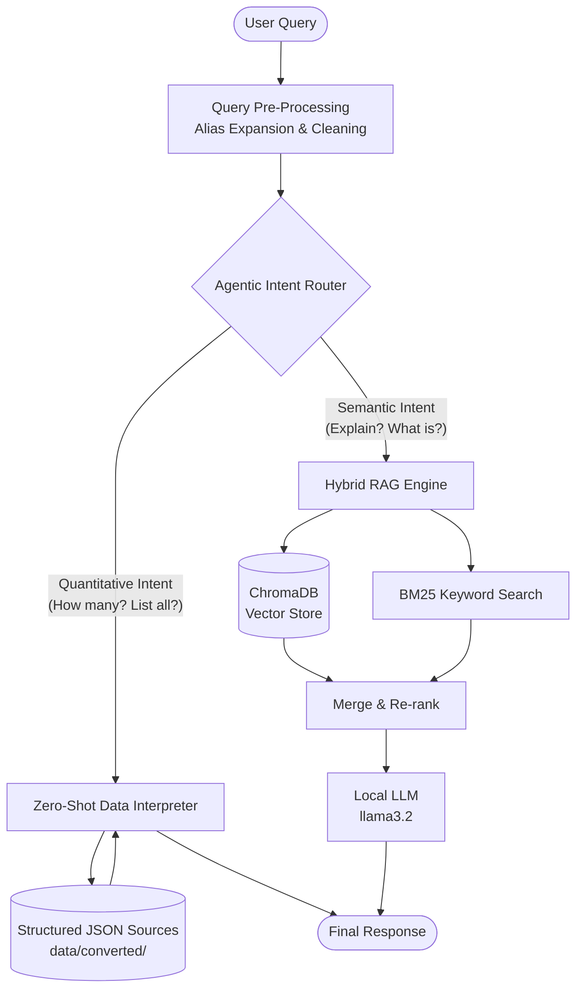

# ResoAI High-Level Architecture

ResoAI is an **Enterprise-Grade RAG Agent** designed for data privacy and high-precision retrieval. It uses a **Hybrid Agentic Architecture** that dynamically routes queries between semantic vector search and deterministic data scanning to ensure 100% accuracy for quantitative questions.

---

## 🏗️ System Overview

The system follows a local-first pattern. All data, embeddings, and LLM logical processing remain on-premises (via **Ollama**), ensuring strict data sovereignty.

### Hybrid Routing Architecture

---

## 🛠️ Core Components

### 1. Data Ingestion & Consolidation
- **Universal Converter**: Decouples document format (PDF, Excel, Word) from the system by converting everything into structured, queryable JSON.
- **Semantic PDF Parser**: Uses `pdftotext` and deterministic regex patterns rather than LLMs for ingestion, ensuring 100% data fidelity without hallucinations during reading.

### 2. The "Brain" (Hybrid Orchestrator)
- **Agentic Router**: identifies user intent. If the query asks for counts or lists (e.g., "How many people in AI?"), it bypasses the vector store to prevent "retrieval missing" hallucinations.
- **Zero-Shot Data Interpreter**: Scans JSON sources in real-time. It uses fuzzy matching and phrase-first scrubbing to identify entities (Locations, Departments, Technologies) without needing hardcoded keyword lists.
- **Vector RAG Engine**: Used for qualitative/semantic questions. Combines Vector Similarity (ChromaDB) with BM25 keyword matching and cross-encoder re-ranking.

### 3. Local AI Infrastructure
- **Ollama**: The heart of the local stack. It hosts `llama3.2` for reasoning and `nomic-embed-text` for semantic mapping.
- **ChromaDB**: Persists document "embeddings" (mathematical fingerprints) locally.

---

## ⚙️ Dynamic Configuration

The system is **Client-Agnostic**. All hardcoded references have been removed from the source code.
- **config.py**: Centralizes all company names, aliases, file paths, and department mappings.
- **.env Overrides**: Deploy for any company by simply updating the environment variables—no coding required.

---
*Last Updated: April 2026*
