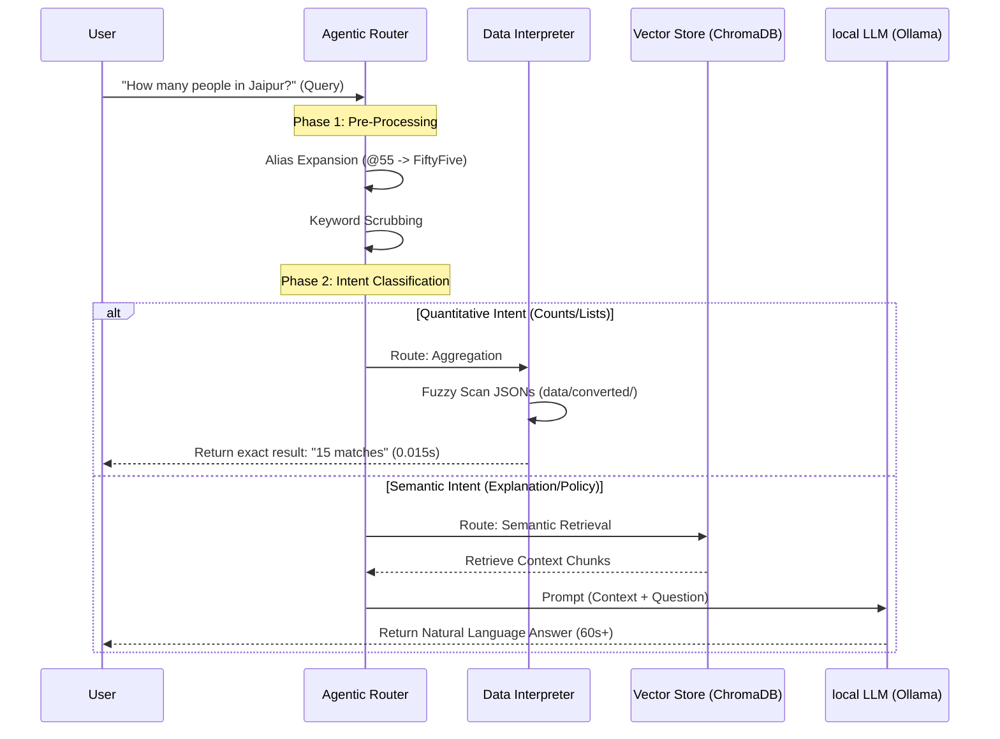

# ResoAI Agent Process Architecture

This document visualizes the internal decision-making process and data flow of the ResoAI agent.

---

## 🔄 End-to-End Query Lifecycle

This sequence diagram illustrates how the **Agentic Router** decides between deterministic scanning and semantic retrieval.

---

## 🧠 Core Processing Stages

### 1. Query Pre-Processing (Phrase-First Scrubbing)
Before any retrieval happens, the query is normalized:
- **Alias Expansion**: Common shorthands like `@55`, `tech`, or `at 55` are expanded to the canonical company name to ensure metadata matches.
- **Scrubbing**: Noise words and filler phrases ("Can you tell me how many", "I want to know if") are stripped using **Phrase-First Scrubbing** to isolate the core subject (e.g., "AI", "Udaipur").

### 2. Zero-Shot Intent Mapping
The agent automatically detects the **Target Entity** (Employee, Project, Policy, Holiday) and the **Operation Type**:
- **Aggregation**: Triggers the Data Interpreter for absolute accuracy.
- **Semantic**: Triggers the RAG pipeline for nuanced explanations.

### 3. Data Interpreter (Precise Agreggation)
Unlike standard RAG, the Data Interpreter **scans raw JSON records**.
- **Pros**: 100% accuracy on counts, no hallucination, extremely fast (sub-millisecond).
- **Technique**: Fuzzy partial matching across all record fields (e.g., matching "Jaipur" in a `location` field or `address` field automatically).

### 4. Vector RAG Engine (Semantic Synthesis)
The fallback path for qualitative questions.
- **BM25**: Finds documents containing exact important terms.
- **Semantic Vector**: Finds documents with similar *concepts* even if words differ.
- **Cross-Encoder**: A final "Re-ranker" that ensures only the top most relevant chunks are sent to the LLM to fit within the context window (`ollama_num_ctx`).

---
*Created by ResoAl Agent - Continuous Deployment V2*
