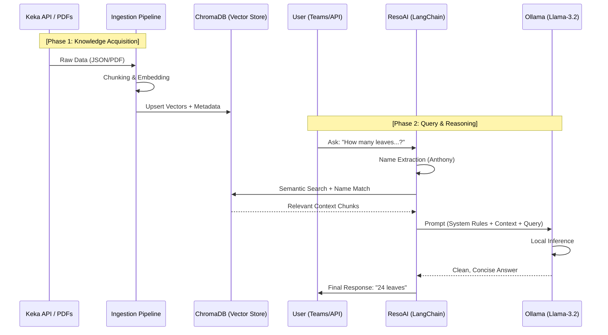

# ResoAI Agent Process Architecture

This document visualizes the internal "brain" and data flow process of the ResoAI agent.

## End-to-End Agent Process (Sequence Diagram)

This diagram shows how data travels through the system from the moment it's ingested to the moment a user receives an answer.

## Functional Architecture

### Core Pipeline Stages

1.  **Ingestion & Vectorization**: 
    - The agent fetches data from the **Employee API** (structured) and **Local PDFs** (unstructured).
    - It uses the **Nomic-Embed** model to convert text into multi-dimensional vectors.
2.  **Contextual Retrieval**:
    - When a query arrives, the agent performs a **Hybrid Search**. It looks for exact name matches (to avoid cross-employee confusion) and semantic matches (to find the right policy).
3.  **Prompt Orchestration**:
    - The agent wraps the retrieved data in a strict **System Prompt** that enforces brevity, numerical precision, and professional tone.
4.  **Local Inference**:
    - The **Ollama** engine runs the **Llama-3.2** model to synthesize the final answer using *only* the provided context, preventing hallucinations.

---
*Created by ResoAI Agent*
