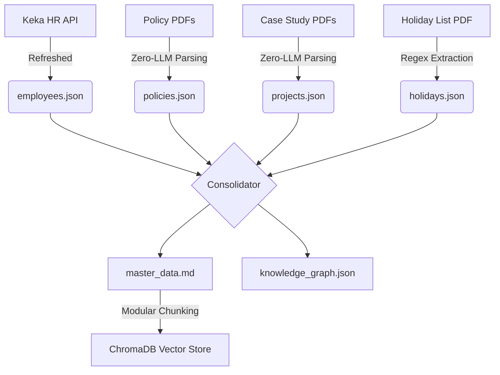
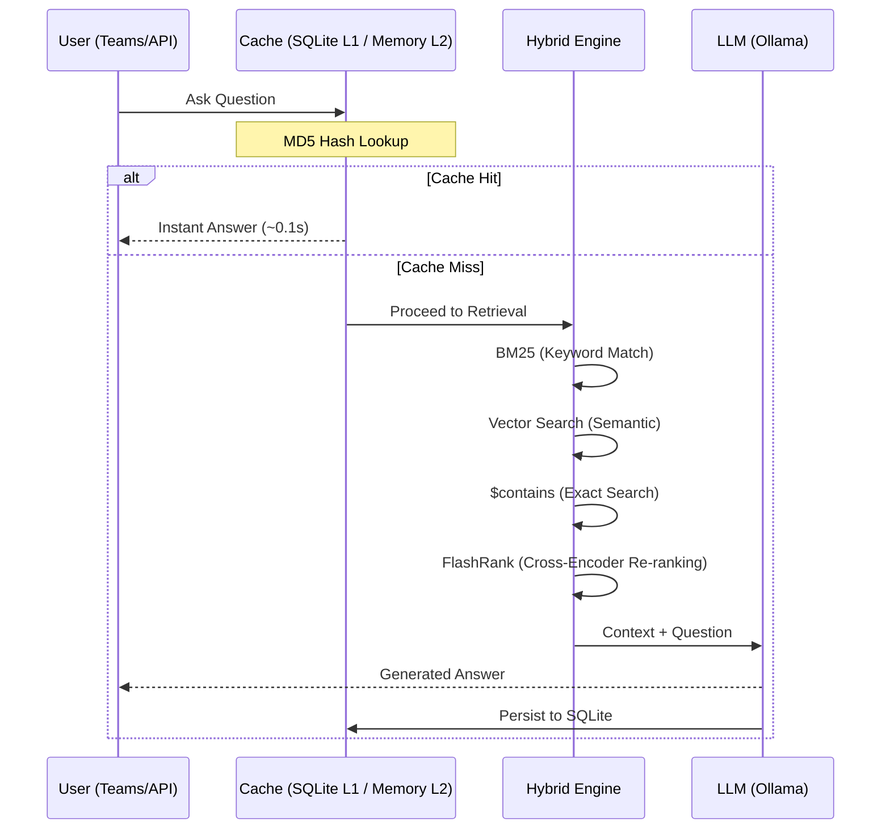

# ResoAI — Intelligent HR RAG Agent

ResoAI is a production-grade, privacy-first Retrieval-Augmented Generation (RAG) system designed to serve as an intelligent interface for HR data and company policies. It integrates with **Microsoft Teams** and provides a sub-second query experience through a multi-level caching and hybrid retrieval engine.

---

## 🏗️ System Architecture

ResoAI follows a **"Modular RAG"** architecture, separating data preparation (Consolidation) from the real-time query pipeline.

### 1. The Data Lifecycle (Zero-LLM Pipeline)
Unlike traditional RAG systems that pipe raw PDFs directly to a vector store, ResoAI uses a deterministic **Source of Truth (SOT)** pipeline.



### 2. The Query Lifecycle (Hybrid Retrieval)
ResoAI achieves high precision by merging semantic search with statistical and keyword matching.



---

## 🚀 Key Features

*   **🔒 Privacy-First**: Runs 100% locally on CPU via **Ollama**. No data ever leaves your infrastructure.
*   **⚡ Sub-Second Performance**: 
    *   **L1 Cache (SQLite)**: Persistent exact-match caching.
    *   **L2 Cache (Memory)**: Semantic-match caching for similar questions.
*   **🎯 High Precision Retrieval**:
    *   **Hybrid Engine**: Combines **BM25** statistical search with **ChromaDB** vector search.
    *   **FlashRank**: Re-ranks candidates using a cross-encoder for the most relevant context.
*   **🛠️ Structured Source of Truth**: Data is consolidated into typed JSON files first, ensuring consistency and auditability.

---

## 🚦 Getting Started

### 1. Setup Environment
```bash
python3 -m venv .venv
source .venv/bin/activate
pip install -e .
cp .env.example .env
```

### 2. Prepare Data (One-Click Sync)
Run the consolidated refresh to rebuild the knowledge base from raw PDFs and the Keka API:
```bash
# Start the server
uvicorn src.main:app --port 8000

# Trigger full refresh & ingestion
curl -X POST http://localhost:8000/api/consolidate-and-ingest
```

---

## 🔌 API Reference

| Endpoint | Method | Description |
| :--- | :--- | :--- |
| `/api/ask` | `POST` | Ask the RAG agent a question. |
| `/api/consolidate-and-ingest` | `POST` | **Primary Sync**: Refresh all JSONs and re-index vector DB. |
| `/api/messages` | `POST` | MS Teams webhook endpoint. |
| `/api/debug` | `POST` | Returns retrieved chunks without LLM generation (for testing). |
| `/api/health` | `GET` | Service health status. |

### Example Query
```bash
curl -X POST http://localhost:8000/api/ask \
     -H "Content-Type: application/json" \
     -d '{"question": "How many leaves does Anthony West have?"}'
```

---

## 📁 Repository Structure

*   `src/main.py`: FastAPI entry point and API route definitions.
*   `src/rag/`: The core RAG engine.
    *   `chain.py`: Orchestrates the retrieval and generation lifecycle.
    *   `cache.py`: Persistent SQLite caching logic.
    *   `embedding.py`: Shared LLM and Embedding factories.
*   `src/consolidator/`: The Data Pipeline.
    *   `ingestors.py`: Raw data to structured JSON (Zero-LLM).
    *   `relationships.py`: Entity linking and knowledge base assembly.
    *   `generator.py`: Produces `master_data.md` and `knowledge_graph.json`.
*   `src/ingestion/`: Bridges JSON data to the Vector Store.
*   `data/`: Persistent storage for ChromaDB, SQLite cache, and SOT JSONs.

---

## 🔧 Deployment
ResoAI is designed to be hosted on a local VPS or workstation. 
*   **CPU**: Optimized for local Llama 3.2 execution.
*   **Memory**: Recommended 8GB+ RAM.
*   **Teams**: Requires **ngrok** or a static IP to expose the `/api/messages` endpoint to the Azure Bot Framework.
